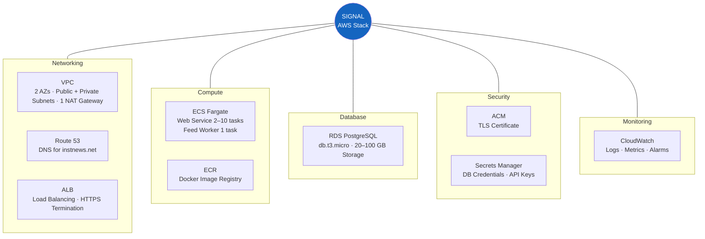
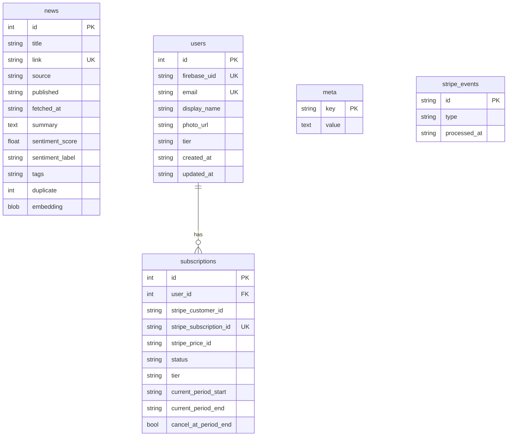

# AWS Services Reference

Every AWS service used in the SIGNAL deployment, what it does, why it was chosen, and its configuration.

## Services Overview



---

## Amazon VPC (Virtual Private Cloud)

**What:** Isolated virtual network containing all resources.

**Configuration:**

| Setting | Value | Reason |
|---------|-------|--------|
| Availability Zones | 2 | Redundancy across physical data centers |
| NAT Gateways | 1 | Allows private subnet resources (ECS, RDS) to reach the internet for RSS fetching. 1 instead of 2 to save ~$32/mo |
| Public Subnets | 2 | Hosts the ALB (internet-facing) |
| Private Subnets | 2 | Hosts ECS tasks and RDS (no direct internet access) |

**Why VPC:** AWS requires it. All resources must live in a VPC. The public/private split ensures the database is never directly accessible from the internet.

**CDK construct:** `ec2.Vpc`

---

## Amazon Route 53

**What:** DNS service that maps `instnews.net` and `www.instnews.net` to the load balancer.

**Records created:**
- `www.instnews.net` → A record (alias) → ALB
- Used by ACM for certificate DNS validation

**Why Route 53:** Tight integration with ALB and ACM. Alias records (free, no query charges) point directly to AWS resources without requiring a static IP.

**CDK construct:** `route53.HostedZone.from_lookup`

---

## AWS Certificate Manager (ACM)

**What:** Free TLS/SSL certificate for HTTPS.

**Configuration:**
- Domain: `instnews.net`
- SAN: `www.instnews.net`
- Validation: DNS (automated via Route 53)
- Auto-renewal: Yes (managed by AWS)

**Why ACM:** Free certificates that auto-renew. No need for Let's Encrypt or manual cert management. Only works with AWS services (ALB, CloudFront).

**CDK construct:** `acm.Certificate`

---

## Application Load Balancer (ALB)

**What:** Distributes incoming HTTP/HTTPS traffic across ECS tasks.

**Configuration:**

| Setting | Value |
|---------|-------|
| Type | Application (Layer 7) |
| Scheme | Internet-facing |
| Listeners | 443 (HTTPS) with ACM cert, 80 (HTTP → redirect to 443) |
| Target Group | ECS tasks on port 8000 |
| Health Check Path | `/api/stats` |
| Health Check Interval | 30 seconds |

**What it does:**
1. Terminates TLS (HTTPS) using the ACM certificate
2. Redirects HTTP to HTTPS automatically
3. Routes requests to healthy ECS tasks (round-robin)
4. Removes unhealthy tasks from rotation

**Why ALB over NLB:** We need Layer 7 features (HTTP health checks, path-based routing, HTTPS termination). NLB is Layer 4 (TCP only).

**CDK construct:** `ecs_patterns.ApplicationLoadBalancedFargateService` (creates ALB automatically)

---

## Amazon ECS (Elastic Container Service) with Fargate

**What:** Runs Docker containers without managing servers. Fargate is the serverless compute engine — you define CPU/memory, AWS handles the rest.

### Web Service

| Setting | Value |
|---------|-------|
| CPU | 0.5 vCPU (512 units) |
| Memory | 1 GB |
| Desired count | 2 |
| Min / Max (auto-scale) | 2 / 10 |
| Scale trigger | CPU > 60% or > 500 requests/target |
| Container | Nginx :8000 → Gunicorn :8001 |
| Health check | `curl http://localhost:8000/api/stats` |

### Feed Worker

| Setting | Value |
|---------|-------|
| CPU | 0.5 vCPU (512 units) |
| Memory | 2 GB (embedding model needs more) |
| Desired count | 1 (fixed) |
| Container | `python -m app.worker` |
| No ALB | Background task, no incoming traffic |

**Why Fargate over EC2:**
- No server management (no patching, no SSH)
- Pay per second of container runtime
- Containers start in ~30 seconds (vs 2-3 min for EC2)
- Same Docker image runs locally and in production

**CDK constructs:** `ecs.FargateTaskDefinition`, `ecs.FargateService`, `ecs_patterns.ApplicationLoadBalancedFargateService`

---

## Amazon ECR (Elastic Container Registry)

**What:** Private Docker image registry. Stores the production images that ECS pulls from.

**Configuration:**
- Repository: `instantnews`
- Lifecycle: Keep last 10 images (auto-delete older)
- Created if not exists, imported if already present

**Image tagging:**
- `latest` — always points to most recent build
- `<git-short-hash>` — immutable tag per deploy

**CDK construct:** `ecr.Repository` or `ecr.Repository.from_repository_name`

---

## Amazon RDS (Relational Database Service)

**What:** Managed PostgreSQL database.

**Configuration:**

| Setting | Value | Reason |
|---------|-------|--------|
| Engine | PostgreSQL 16 | Latest stable, pgvector support |
| Instance | db.t3.micro | Cheapest option, sufficient for launch |
| Storage | 20 GB initial, auto-scale to 100 GB | Starts small, grows with data |
| Multi-AZ | No | Cost savings; enable for production HA |
| Backup retention | 7 days | Automatic daily snapshots |
| Deletion protection | Off | Enable for real production |
| Subnet | Private | Not accessible from internet |

**Database schema:**



**CDK construct:** `rds.DatabaseInstance`

---

## AWS Secrets Manager

**What:** Encrypted storage for credentials and API keys. Values are injected into ECS containers as environment variables at runtime.

**Secrets:**

| Secret Name | Contents | Created By |
|-------------|----------|------------|
| `instantnews/db` | `username`, `password`, `DATABASE_URL` | CDK (auto-generated password) |
| `instantnews/app` | `FIREBASE_CREDENTIALS_JSON`, `STRIPE_SECRET_KEY`, `STRIPE_WEBHOOK_SECRET`, `STRIPE_PRICE_PLUS`, `STRIPE_PRICE_MAX` | Manual (after stack deploy) |

**Why Secrets Manager:** Secrets are never in code, environment files, or Docker images. ECS injects them at container start. Supports automatic rotation.

**CDK construct:** `secretsmanager.Secret`

---

## Amazon CloudWatch

**What:** Logging, metrics, and monitoring.

**Log groups:**
- `/ecs/instantnews-web` — Nginx + Gunicorn logs
- `/ecs/instantnews-worker` — Feed worker logs
- Retention: 1 month

**Metrics used for auto-scaling:**
- ECS CPU utilization
- ALB request count per target

**CDK constructs:** `logs.LogGroup`, `ecs.LogDrivers.aws_logs`

---

## Cost Breakdown

```mermaid
graph LR
    subgraph Monthly Cost — ~$120-150
        NAT[NAT Gateway<br/>~$32]
        WEB[ECS Web — 2 tasks<br/>~$35]
        WKR[ECS Worker — 1 task<br/>~$30]
        DB_COST[RDS PostgreSQL<br/>~$20]
        LB[ALB<br/>~$16]
        OTHER[Other — ECR, R53,<br/>Secrets, CW<br/>~$5]
    end

    style NAT fill:#c62828,color:#fff
    style WEB fill:#e65100,color:#fff
    style WKR fill:#e65100,color:#fff
    style DB_COST fill:#1565c0,color:#fff
    style LB fill:#6a1b9a,color:#fff
    style OTHER fill:#388e3c,color:#fff
```

| Service | Monthly Cost |
|---------|-------------|
| NAT Gateway | ~$32 |
| ECS Fargate (web, 2 tasks) | ~$30-40 |
| ECS Fargate (worker, 1 task) | ~$25-35 |
| RDS PostgreSQL | ~$15-25 |
| ALB | ~$16 |
| Route 53 | ~$0.50 |
| ECR, Secrets, CloudWatch | ~$3 |
| **Total** | **~$120-150** |
