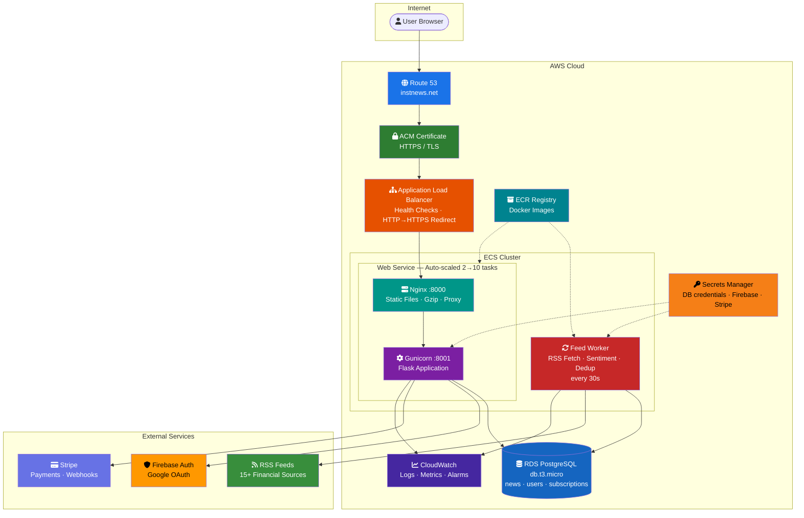
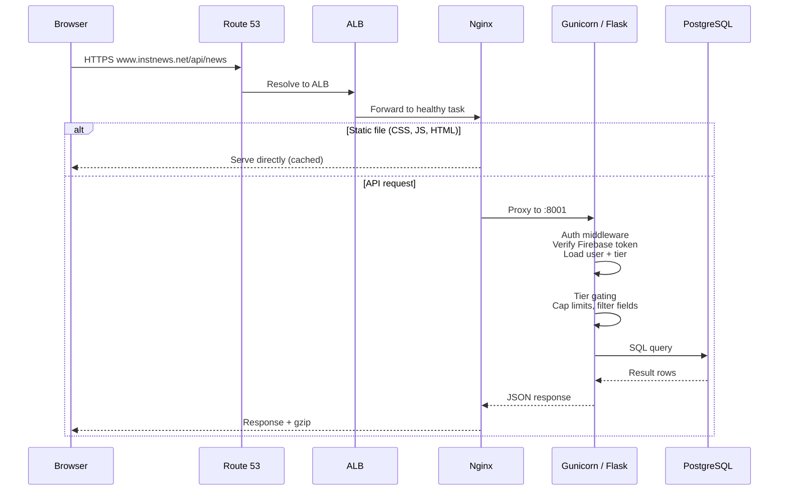
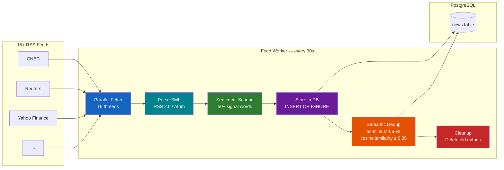
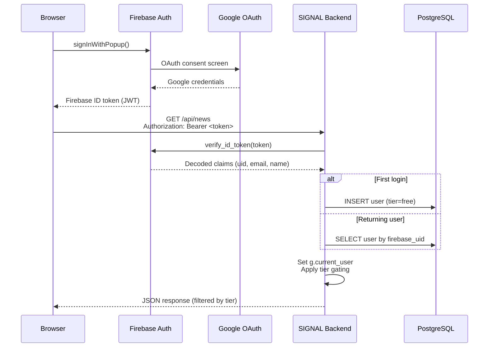
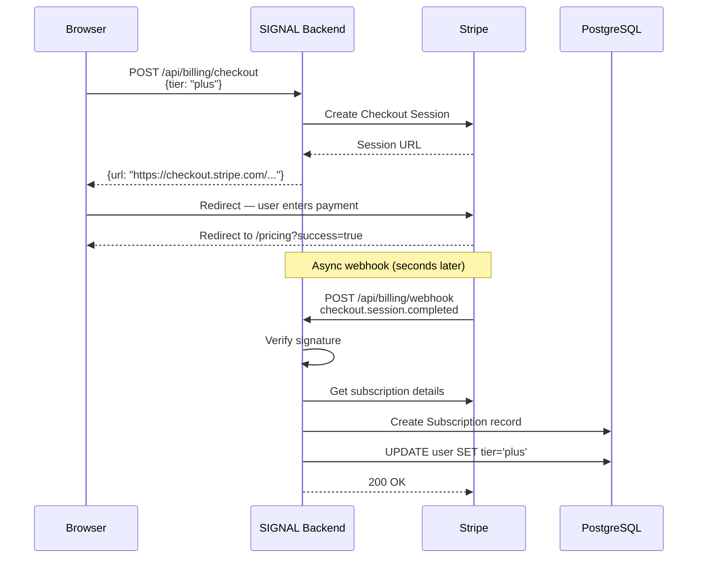
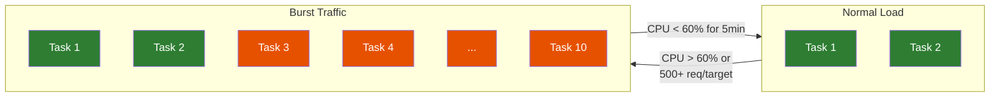

# Architecture Overview

## System Architecture

## Request Flow

## Data Ingestion Pipeline

## Authentication Flow

## Payment Flow

## Auto-Scaling Behavior

| Parameter | Value |
|-----------|-------|
| Min tasks | 2 |
| Max tasks | 10 |
| Scale-out trigger | CPU > 60% or > 500 req/target |
| Scale-out cooldown | 60 seconds |
| Scale-in cooldown | 300 seconds |
| Worker tasks | 1 (fixed, no scaling) |
