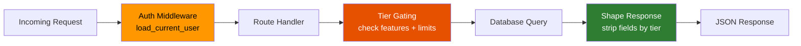

# Backend Structure

## Module Map

```mermaid
graph TB
    subgraph Entry Points
        SERVER[server.py<br/>Gunicorn WSGI entry]
        WORKER_EP[python -m app.worker<br/>Background feed worker]
    end

    subgraph app [app/]
        INIT[__init__.py<br/>create_app factory]
        CONFIG[config.py<br/>Environment config]
        DB[database.py<br/>SQLAlchemy engine]
        MODELS[models.py<br/>News · User · Subscription · Meta]

        subgraph auth [auth/]
            FIREBASE[firebase.py<br/>Admin SDK · Token verify]
            MIDDLEWARE[middleware.py<br/>before_request hook]
            AUTH_ROUTES[routes.py<br/>/api/auth/*]
        end

        subgraph billing [billing/]
            TIERS[tiers.py<br/>Feature flags · Limits]
            STRIPE[stripe_client.py<br/>Stripe SDK wrapper]
            BILL_ROUTES[routes.py<br/>/api/billing/*]
        end

        subgraph middleware_pkg [middleware/]
            TIERGATE[tier_gate.py<br/>@require_feature<br/>@require_tier]
        end

        subgraph routes [routes/]
            NEWS[news.py<br/>GET /api/news]
            SOURCES[sources.py<br/>GET /api/sources]
            STATS[stats.py<br/>GET /api/stats]
            REFRESH[refresh.py<br/>POST /api/refresh]
            DOCS[docs.py<br/>GET /api/docs]
            STATIC[static_pages.py<br/>/ · /pricing]
        end

        subgraph services [services/]
            SENT[sentiment.py<br/>Keyword scoring]
            PARSER[feed_parser.py<br/>RSS/Atom parsing]
            FEED[feed_refresh.py<br/>Parallel fetch orchestration]
            DEDUP_SVC[dedup.py<br/>Embedding similarity]
        end

        WORKER_MOD[worker.py<br/>APScheduler loop]
    end

    SERVER --> INIT
    WORKER_EP --> WORKER_MOD
    INIT --> CONFIG
    INIT --> DB
    INIT --> MIDDLEWARE
    INIT --> AUTH_ROUTES
    INIT --> BILL_ROUTES
    INIT --> NEWS & SOURCES & STATS & REFRESH & DOCS & STATIC
    NEWS --> TIERGATE
    NEWS --> FEED
    TIERGATE --> TIERS
    MIDDLEWARE --> FIREBASE
    MIDDLEWARE --> MODELS
    FEED --> PARSER
    FEED --> DEDUP_SVC
    PARSER --> SENT
    WORKER_MOD --> FEED
    DB --> MODELS

    style SERVER fill:#1565c0,color:#fff
    style WORKER_EP fill:#c62828,color:#fff
    style INIT fill:#6a1b9a,color:#fff
    style TIERS fill:#e65100,color:#fff
    style TIERGATE fill:#e65100,color:#fff
```

## Key Patterns

### App Factory

`create_app(config_class)` in `app/__init__.py`:

1. Creates Flask instance with static folder
2. Initializes SQLAlchemy engine from `DATABASE_URL`
3. Creates all tables (dev bootstrap)
4. Registers `before_request` auth middleware
5. Registers all route blueprints
6. Optionally starts APScheduler background worker
7. Returns the app

### Request Lifecycle



### Database Access

- Each route handler creates its own session via `session_factory()`
- Sessions are closed in `finally` blocks
- Auth middleware uses a detached `CurrentUser` object to avoid `DetachedInstanceError`
- Feed worker threads each create their own session (thread safety)

### Testing

```bash
python -m pytest tests/ -v                          # Run all
python -m pytest tests/test_routes.py -v            # Single file
python -m pytest tests/ --cov=app --cov-report=term # Coverage
```

All tests use in-memory SQLite with `StaticPool` (shared across connections). External services (Firebase, Stripe, RSS feeds) are mocked.
