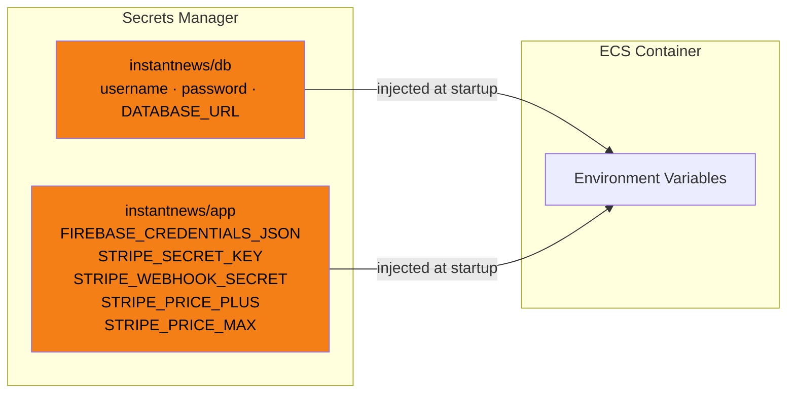

# Configuration Reference

All configuration is via environment variables. See `.env.example` for a template.

## Application Settings

| Variable | Default | Description |
|----------|---------|-------------|
| `DATABASE_URL` | `sqlite:///data/news_terminal.db` | Database connection string. Use `postgresql://...` for production |
| `PORT` | `8000` | HTTP server port |
| `STALE_SECONDS` | `30` | Seconds before cached data is considered stale |
| `FETCH_TIMEOUT` | `5` | Timeout per RSS feed HTTP request (seconds) |
| `DEDUP_THRESHOLD` | `0.85` | Cosine similarity threshold for duplicate detection (0.0–1.0) |
| `MAX_AGE_DAYS` | `1825` | Maximum age of stored news items (default 5 years) |
| `WORKER_INTERVAL_SECONDS` | `30` | Feed worker refresh interval |
| `WORKER_ENABLED` | `true` | Enable in-process background worker (set `false` when using separate worker container) |
| `GUNICORN_PORT` | `8001` | Internal Gunicorn port (used by Nginx proxy in production) |

## Authentication

| Variable | Default | Description |
|----------|---------|-------------|
| `FIREBASE_CREDENTIALS` | _(none)_ | Path to Firebase service account JSON file |
| `FIREBASE_CREDENTIALS_JSON` | _(none)_ | Firebase service account JSON as a string (for containers) |

Set one or the other. If neither is set, Firebase token verification is disabled and all users are treated as anonymous (free tier).

## Payments

| Variable | Default | Description |
|----------|---------|-------------|
| `STRIPE_SECRET_KEY` | _(empty)_ | Stripe API secret key (`sk_live_...` or `sk_test_...`) |
| `STRIPE_WEBHOOK_SECRET` | _(empty)_ | Stripe webhook signing secret (`whsec_...`) |
| `STRIPE_PRICE_PLUS` | _(empty)_ | Stripe Price ID for Plus tier (`price_...`) |
| `STRIPE_PRICE_MAX` | _(empty)_ | Stripe Price ID for Max tier (`price_...`) |

When `STRIPE_SECRET_KEY` is empty, the checkout endpoint returns 503 "Payment system is coming soon."

## AWS Secrets Manager

In production, secrets are stored in AWS Secrets Manager and injected into ECS containers:

