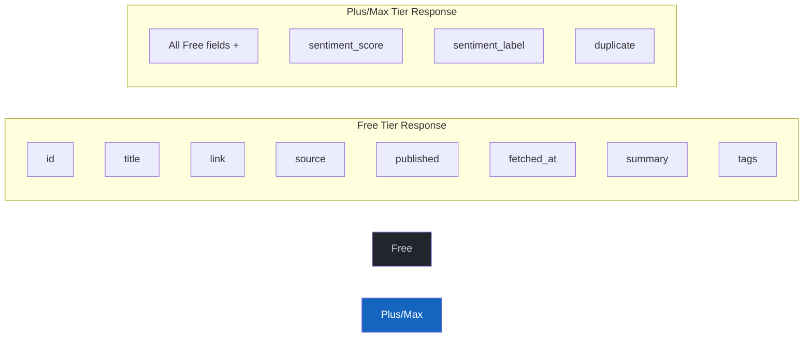

# API Reference

**Base URL:** `https://www.instnews.net`

All responses are JSON. Authentication is optional — unauthenticated requests receive free-tier access.

## Authentication

Include a Firebase ID token in the `Authorization` header:

```
Authorization: Bearer <firebase_id_token>
```

Without this header, all requests are treated as free-tier (anonymous).

---

## Endpoints

### GET /api/news

Returns news items with optional filtering.

**Parameters:**

| Parameter | Type | Default | Description |
|-----------|------|---------|-------------|
| `limit` | int | tier max | Number of items to return. Capped by tier (Free: 50, Plus: 200, Max: 500) |
| `source` | string | `all` | Filter by source name (e.g. `CNBC`, `Reuters_Business`) |
| `sentiment` | string | `all` | Filter by sentiment: `bullish`, `bearish`, `neutral` |
| `q` | string | _(none)_ | Keyword search in title and summary |
| `from` | string | _(none)_ | Start date, ISO 8601 (e.g. `2026-03-01`). **Plus/Max only** |
| `to` | string | _(none)_ | End date, ISO 8601 (e.g. `2026-03-20`). **Plus/Max only** |

**Response:**

```json
{
  "count": 2,
  "items": [
    {
      "id": 1234,
      "title": "S&P 500 Surges to Record High on Strong Earnings",
      "link": "https://www.cnbc.com/...",
      "source": "CNBC",
      "published": "2026-03-20T14:30:00+00:00",
      "fetched_at": "2026-03-20T14:31:12+00:00",
      "summary": "The S&P 500 index rallied to a new all-time high...",
      "sentiment_score": 1.0,
      "sentiment_label": "bullish",
      "tags": "",
      "duplicate": 0
    }
  ]
}
```

**Tier-dependent fields:**



| Field | Free | Plus/Max | Description |
|-------|------|----------|-------------|
| `id` | Yes | Yes | Unique item ID |
| `title` | Yes | Yes | Headline text |
| `link` | Yes | Yes | URL to original article |
| `source` | Yes | Yes | Feed source name |
| `published` | Yes | Yes | Publication time (ISO 8601) |
| `fetched_at` | Yes | Yes | When SIGNAL fetched the item |
| `summary` | Yes | Yes | Article excerpt (max 500 chars) |
| `tags` | Yes | Yes | Reserved for future use |
| `sentiment_score` | **No** | Yes | Score from -1.0 (bearish) to 1.0 (bullish) |
| `sentiment_label` | **No** | Yes | `bullish`, `bearish`, or `neutral` |
| `duplicate` | **No** | Yes | `1` if duplicate of another item, `0` if original |

---

### GET /api/sources

Returns all active feed sources with item counts.

**Response:**

```json
{
  "sources": [
    {
      "name": "CNBC",
      "url": "https://search.cnbc.com/rs/search/...",
      "last_fetch_items": 12,
      "total_items": 4521,
      "active": true
    }
  ]
}
```

---

### GET /api/stats

Returns aggregated statistics.

**Response:**

```json
{
  "total_items": 15234,
  "by_source": {
    "CNBC": 4521,
    "Reuters_Business": 3200,
    "MarketWatch": 2800
  },
  "by_sentiment": {
    "bullish": 5100,
    "bearish": 3200,
    "neutral": 6934
  },
  "avg_sentiment_score": 0.0423,
  "last_refresh": "2026-03-20T14:31:12+00:00",
  "feed_count": 15
}
```

---

### POST /api/refresh

Force an immediate refresh of all feeds. Returns the count of new items found.

**Response:**

```json
{
  "refreshed": true,
  "new_items": 7,
  "source_status": {
    "CNBC": 2,
    "Reuters_Business": 1,
    "MarketWatch": 3,
    "Yahoo_Finance": 1
  },
  "timestamp": "2026-03-20T14:35:00+00:00"
}
```

---

### GET /api/docs

Returns API documentation as JSON.

---

### GET /api/auth/me

**Requires authentication.**

Returns the current user's profile.

**Response:**

```json
{
  "user": {
    "id": 42,
    "email": "trader@example.com",
    "display_name": "Alex Trader",
    "photo_url": "https://lh3.googleusercontent.com/...",
    "tier": "plus",
    "created_at": "2026-03-15T10:00:00+00:00"
  }
}
```

---

### GET /api/auth/tier

Returns the current user's tier, feature flags, and limits. Works for both authenticated and anonymous users.

**Response:**

```json
{
  "tier": "free",
  "features": {
    "news_feed": true,
    "keyword_search": true,
    "source_filter": true,
    "sentiment_filter": false,
    "deduplication": false,
    "date_range_filter": false,
    "ai_ticker_recommendations": false,
    "price_analysis": false,
    "advanced_analytics": false
  },
  "limits": {
    "max_items_per_request": 50,
    "api_rate_per_minute": 10,
    "refresh_interval_min_ms": 30000,
    "history_days": 7
  }
}
```

---

### GET /api/pricing

Returns all tier definitions for the pricing page.

**Response:**

```json
{
  "tiers": {
    "free":  { "name": "Free", "price_monthly_cents": 0,    "features": {...}, "limits": {...} },
    "plus":  { "name": "Plus", "price_monthly_cents": 1499, "features": {...}, "limits": {...} },
    "max":   { "name": "Max",  "price_monthly_cents": 3999, "features": {...}, "limits": {...} }
  }
}
```

---

### POST /api/billing/checkout

**Requires authentication.**

Creates a Stripe Checkout session for subscribing to a paid tier.

**Request body:**

```json
{ "tier": "plus" }
```

**Response:**

```json
{ "url": "https://checkout.stripe.com/c/pay/cs_..." }
```

Redirect the user to the returned URL.

---

### POST /api/billing/portal

**Requires authentication.**

Creates a Stripe Customer Portal session for managing an existing subscription (cancel, change plan, update payment).

**Response:**

```json
{ "url": "https://billing.stripe.com/p/session/..." }
```

---

### GET /api/billing/status

**Requires authentication.**

Returns the current subscription status.

**Response:**

```json
{
  "subscription": {
    "id": 1,
    "status": "active",
    "tier": "plus",
    "current_period_start": "2026-03-01T00:00:00+00:00",
    "current_period_end": "2026-04-01T00:00:00+00:00",
    "cancel_at_period_end": false
  }
}
```

---

## Error Responses

All errors follow a consistent format:

```json
{
  "error": "Description of what went wrong"
}
```

| HTTP Status | Meaning |
|-------------|---------|
| `400` | Bad request (invalid parameters) |
| `401` | Authentication required |
| `403` | Feature not available on your tier |
| `404` | Resource not found |
| `429` | Rate limit exceeded (future) |
| `500` | Internal server error |
| `503` | Service unavailable (e.g. Stripe not configured) |

### 403 Tier Gating Response

```json
{
  "error": "Feature not available on your current plan",
  "feature": "ai_ticker_recommendations",
  "current_tier": "free",
  "upgrade_url": "/pricing"
}
```
