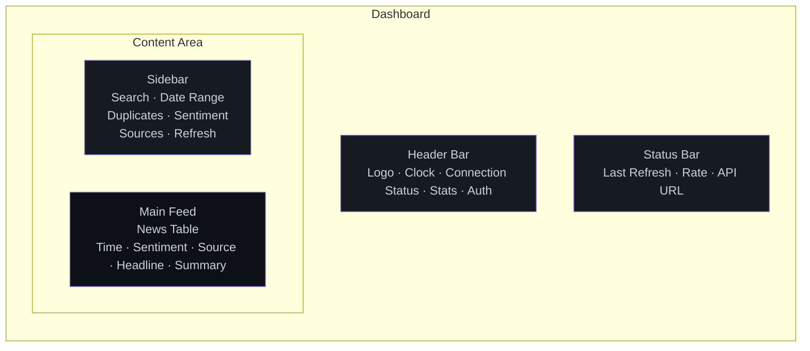
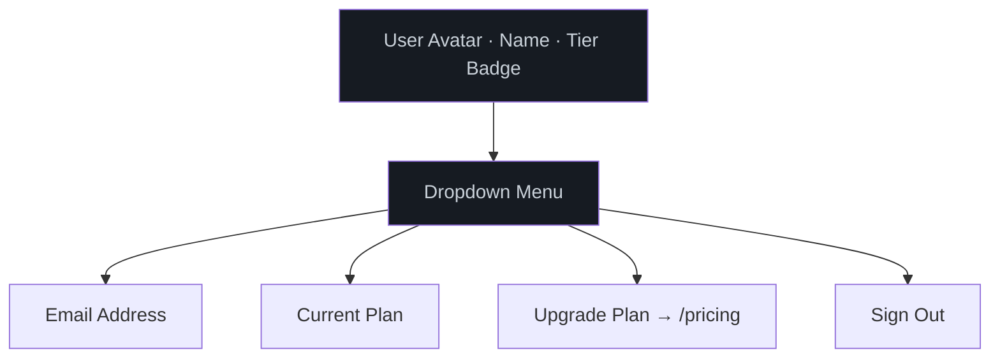

# Dashboard UI Guide

## Layout

## Header Bar

| Element | Description |
|---------|-------------|
| **SIGNAL logo** | Click to refresh the page |
| **Clock** | Current time (local timezone) |
| **Connection dot** | Green = connected, Red = disconnected |
| **Items** | Total news items in database |
| **Feeds** | Number of active feed sources |
| **Avg Sent** | Average sentiment score across all items |
| **Sound** | Toggle notification sounds for new items |
| **Refresh** | Force immediate feed refresh |
| **API Docs** | Open API documentation modal |
| **Sign In / User Menu** | Google sign-in or user profile with tier badge |

## Sidebar Filters

### Search
Type keywords to filter headlines in real-time. Shortcut: press `F`.

### Date Range (Plus/Max only)
Filter news by date range. Free tier shows the inputs but they are not applied.

### Hide Duplicates (Plus/Max only)
Checkbox to hide stories that appear across multiple sources.

### Sentiment Filter
Filter by sentiment classification:

| Button | Shortcut | Shows |
|--------|----------|-------|
| All | `1` | All items |
| Bullish | `2` | Positive sentiment only |
| Bearish | `3` | Negative sentiment only |
| Neutral | `4` | No strong sentiment |

### Sources
Toggle individual sources on/off. Each source shows its item count.

### Refresh Interval
Select how often the dashboard polls for new data:
- 3 / 5 / 10 / 15 / 30 / 60 seconds

## News Table

Each row contains:

| Column | Description |
|--------|-------------|
| **Time** | Publication time (relative: "2m ago", "1h ago") |
| **Sentiment** | Color-coded badge: green (bullish), red (bearish), yellow (neutral) |
| **Source** | Feed source name |
| **Headline** | Article title (click to open original article) |
| **Summary** | First ~100 characters of the article description |

### Visual Indicators

- **Flash animation**: New items flash briefly when they appear
- **DUP badge**: Yellow badge on duplicate stories (Plus/Max only)
- **Sentiment bar**: Colored bar indicating sentiment score intensity

## Keyboard Shortcuts

| Key | Action |
|-----|--------|
| `R` | Force refresh all feeds |
| `F` | Focus the search input |
| `1` | Show all sentiments |
| `2` | Filter to bullish only |
| `3` | Filter to bearish only |
| `4` | Filter to neutral only |

## User Menu (When Signed In)

### Tier Badges

| Badge | Color | Meaning |
|-------|-------|---------|
| `FREE` | Gray | Free tier (default) |
| `PLUS` | Blue | Plus subscription active |
| `MAX` | Gold | Max subscription active |

## Pricing Page

Accessible at [/pricing](https://www.instnews.net/pricing) or via the "Upgrade Plan" menu item.

Shows three-column comparison of Free / Plus / Max tiers with feature checkmarks and Subscribe buttons.
