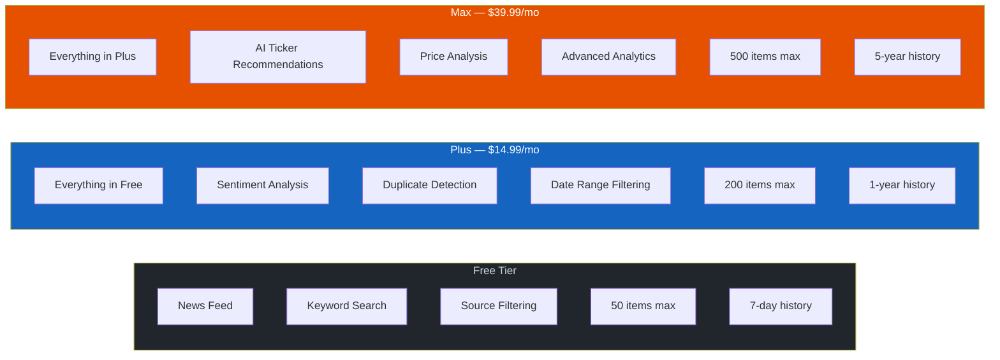

# Getting Started

## What is SIGNAL?

SIGNAL is a real-time financial news aggregation terminal. It collects headlines from 15+ financial news sources, scores their sentiment (bullish/bearish/neutral), detects duplicate stories across sources, and delivers everything through a fast web dashboard and REST API.

## Quick Start

### Web Dashboard

Open [www.instnews.net](https://www.instnews.net) in your browser. No account required for the free tier.

### API

```bash
curl "https://www.instnews.net/api/news?limit=5"
```

### Sign In (Optional)

Click **Sign In** in the top-right corner to authenticate with your Google account. Signing in unlocks account features and allows upgrading to paid tiers.

## Free vs Paid



See [[Subscription Tiers|User-Manual:-Subscription-Tiers]] for full details.

## News Sources

| Source | Coverage |
|--------|----------|
| CNBC | US markets, breaking news |
| CNBC World | International markets |
| Reuters Business | Global financial news |
| MarketWatch | Market analysis, top stories |
| MarketWatch Markets | Market pulse, real-time |
| Yahoo Finance | Broad financial news |
| Nasdaq | Market-focused news |
| SeekingAlpha | Market currents, analysis |
| Benzinga | Trading news, all categories |
| Investing.com | Global markets RSS |
| AP News Business | Wire service business news |
| Bloomberg Business | Business news (via RSS proxy) |
| Bloomberg Markets | Markets news (via RSS proxy) |
| BBC Business | UK/global business |
| Google News Business | Aggregated business news |
